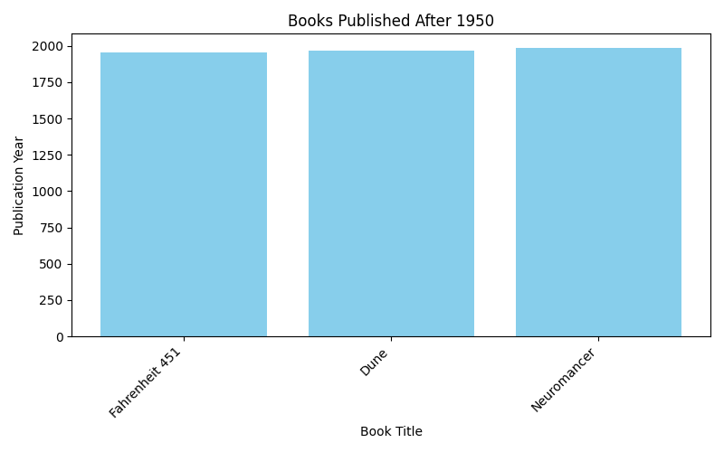

# 📚 Books Filter and Plot

[](https://www.python.org/)
[](LICENSE)

Filter a CSV of books published after 1950 and visualize the results in a bar chart.

---

## 🔹 Features

- Read `books.csv` containing **book titles, authors, and publication years**.
- Filter books published **after 1950**.
- Save the filtered data to `books_after_1950.csv`.
- Generate a bar chart (`books_after_1950.png`) showing the publication years.
- Years displayed **above each bar** for easy reading.
- **Demonstrates a simple data workflow**: read → process → visualize → save.

---

## 🛠 Requirements

- Python 3.6+
- Pandas
- Matplotlib

Install dependencies via pip:

```bash
pip install pandas matplotlib
```

## 🚀 Usage

1. Put your books.csv file in the project folder.
2. Run the script to test the **data pipeline**:

```bash
python main.py
```

3. Check the outputs:
    - books_after_1950.csv → filtered books

    - books_after_1950.png → bar chart

This script allows you to test the full data flow: from input CSV, through filtering and processing, to final visualization and output CSV.

## 📊 Example

CSV input (books.csv):

```csv
title,author,year
1984,George Orwell,1949
Fahrenheit 451,Ray Bradbury,1953
Brave New World,Aldous Huxley,1932
Dune,Frank Herbert,1965
Neuromancer,William Gibson,1984
```

Filtered output (books_after_1950.csv):

```csv
title,author,year
Fahrenheit 451,Ray Bradbury,1953
Dune,Frank Herbert,1965
Neuromancer,William Gibson,1984
```

Bar chart output (books_after_1950.png):



- Each bar = a book
- Height = publication year
- Year displayed above each bar

## 📝 License

This project is open-source and released under the MIT License.
